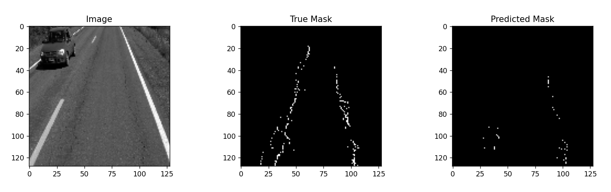

# Pothole ML Detection
Machine learning image segmentation for road potholes. Part of data mining class (CSI 4352) project.

## Motivation
The basis behind this project comes from an interest in urban planning and making improvements to cities and the ways in which we interact with them. If this could be automated (i.e. through machine learning), government departments could be better equipped with tools and information to improve their cities.

## Dataset
This project utilizes the simplex pothole dataset provided by Thompson et al. published [here](https://www.sciencedirect.com/science/article/abs/pii/S0097849322001418). The dataset is extended as well with custom images/masks extracted from the Google Street View API and manually constructed.

## Results
99% accuracy and 69% precision over ~40 epochs, a validation test is provided below:

